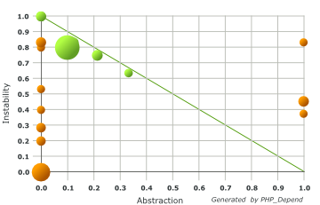
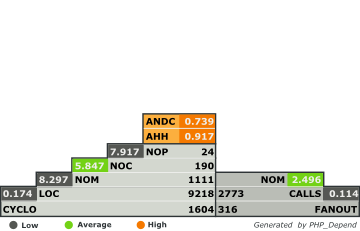

Flux: Fluid FlexForms
=====================

> Flux uses Fluid ViewHelpers to define a form structure which can be rendered in the TYPO3 backend when editing special types of
> records - used for example by the Fluid Content extension to enable dynamic content elements based on Fluid templates. Can be
> used in your own plugins to enable dynamic forms and a few extra features such as adding nested content elements to your plugin
> or performing special actions whenever a record from your extension is saved, moved, deleted and so on.

## Code Quality

_Understanding the [Abstraction Instability Chart](http://pdepend.org/documentation/handbook/reports/abstraction-instability-chart.html)
and [Pyramid Chart](http://pdepend.org/documentation/handbook/reports/overview-pyramid.html)._

## What does it do?

Flux uses a range of ViewHelpers to define a set of configuration (fields, their layout, how to process them etc) inside a Fluid
template (which can also be rendered just like any normal Fluid template). By reading this stored configuration Flux provides a
universal way to read a standard type of configuration which applies to records (pages, content, domain logic records).

## Why use it?

Flux is a much, much faster way to create FlexForm-style configuration fields in any record type. In addition to this, Flux also
provides an extensible way to interact with records of any type when they are saved, deleted, moved etc. in the TYPO3 backend.
All in all it allows you to create very flexible processing logic which can also be called upon when you render templates from
your extension. This has many uses:

* EXT:fluidcontent uses this to provide a way to use one special type of content element to render a multitude of highly
  flexible content elements which can, just as an example, function as container elements for other content elements. By attaching
  itself to records from the `tt_content` table it is able to manipulate the backend use and frontend rendering of content records.
* EXT:fluidpages uses this to provide a similar integration as EXT:fluidcontent but with the `pages` table, which means that
  instead of attaching itself to the content use and rendering, it attaches itself to the page manipulation in backend and
  rendering of pages in the frontend.
* EXT:fluidbackend uses this to interact with a special type of configuration storage record and present the form fields configured
  in Fluid template files as (the core interface of) custom TYPO3 backend modules which can also render any content normally
  usable in Fluid templates.
* EXT:tweetnews uses this to hook into record saving and manipulation of the "News" record from EXT:news in order to query the
  Twitter API and analyse a few preset rules to determine if the news item has already been tweeted, as well as present a bit of
  status reporting from the Twitter API interaction.

These are just examples which each use a different TYPO3 database record type to perform advanced operations associated with that
particular record type.

## Examples

The logic of Flux is, since it is ViewHelper based, a simple question of learning a basic approach regarding template structure.
And since Flux is always used in the same manner regardless of the associated record type, it becomes much easier to demonstrate
and illustrate (not to speak of explaining in a non-abstract way) how Flux does what Flux does - if seen in the context of a
specific implementation such as, but not limited to, EXT:fluidcontent.

Therefore the best advise is this:

* Study the guides for creating Flux configurations in the context where you consider using it. This gives you a good frame of
  reference and a clear goal as use case. For example: studying a page templating guide for EXT:fluidpages naturally show you
  how fields are used (as will any Flux-related guide) but more importantly, it also demonstrates how to access the fields when
  rendering takes place.
* Always keep the [ViewHelper Reference for Flux](http://fedext.net/viewhelpers/flux.html) handy; it clearly specifies every
  option you have when it comes to building the configuration.
* Remember that Flux fields and the concept around building a form out of those fields, is exactly the same concept as the well-
  known TCEforms, which you have come across in many other aspects: it all uses the same way of thinking as when you define TCA
  for your records or when you create - well, used to create, anyway ;) - XML based FlexForms. Many names are the same and the
  attributes are available are (as far as possible) replicated in Flux field ViewHelpers.

## Known Issues

* Keep In mind to have you PHP configured correctly to accept a fairly large number of input fields. When nesting
  sections / objects the number of fields submitted, rises drastically. The php.ini configuration setting to think about, is
  ``max_input_vars``. If this number is too small, the TYPO3 Backend (effectively PHP) will decline the submission of the
  Backend Form and will die with an "Invalid CSRF Token" message.

## References

Other extensions which are closely related to this extension:

* https://github.com/FluidTYPO3/vhs is a highly suggested companion for any type of Fluid templates, providing useful ViewHelpers.

